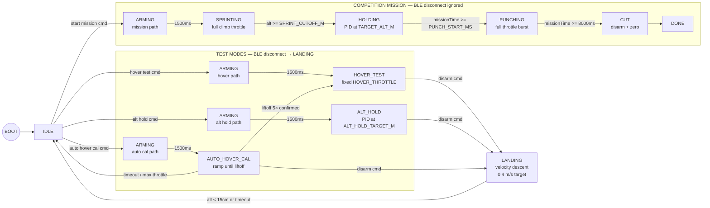
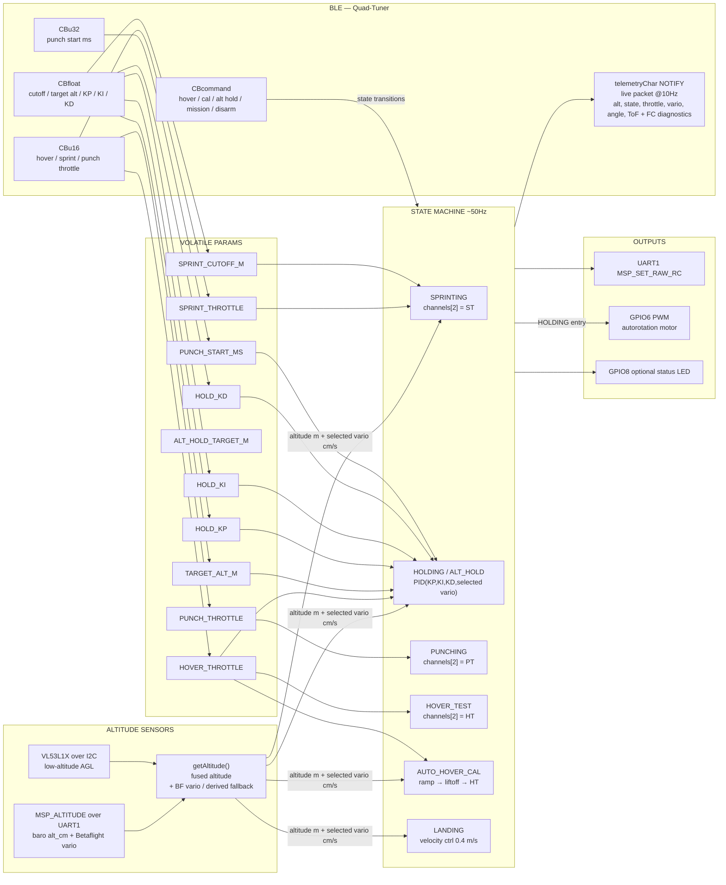

# Quad Mission Controller

Autonomous competition launch system for a 3" FPV quadcopter. The goal is to maximize total air time under a strict **8-second powered flight limit** and **60ft altitude requirement**.

The quad sprints to 60ft as fast as possible, holds altitude while the clock runs down, then punches full throttle in the final moments to build upward velocity before motor cut. Descent is handled by an onboard autorotation device that is pre-spun by a brushed DC motor during the climb. No RC transmitter or receiver is used — an ESP32-S3 acts as the flight controller's RC input via MSP over UART.

---

## Hardware

| Component | Role |
|---|---|
| Happymodel EX1404 4800KV (×4) | Propulsion |
| HQProp T3×2×3 | Props |
| GNB 300mAh 2–3S 80C LiHV XT30 | Power |
| BetaFPV F4 2-3S AIO | FC + ESC |
| ESP32-S3 Super Mini | Mission controller |
| VL53L1X ToF sensor | Low-altitude AGL altitude reference |
| Brushed DC motor (3–12V) | Autorotation pre-spin |
| 2N2222 NPN transistor + 1N4148 + 100Ω | Brushed motor driver |

---

## Wiring

```
GNB 3S LiHV
  └── XT30 → ESC VBAT/GND pads
        └── 100µF cap across VBAT/GND (as close to pads as possible)

BetaFPV F4 2-3S
  ├── 5V pad  → ESP32 VIN
  ├── GND pad → ESP32 GND
  ├── UARTx TX → ESP32 GPIO5  (x = whichever UART pad is used; note for CLI serial command)
  ├── UARTx RX → ESP32 GPIO4
  └── 5V or 9V pad → Brushed motor (+)  (check available BEC voltage on this board)

VL53L1X ToF sensor
  ├── VIN/VCC → ESP32 3V3  (sensor operating range is 2.6–3.5V; do not power a bare LGA sensor from 5V)
  ├── GND     → ESP32 GND
  ├── SDA     → ESP32 GPIO10
  ├── SCL     → ESP32 GPIO11
  ├── INT     → not connected
  └── SHUT    → not connected by default (`TOF_SHUT_PIN = -1`)

NPN transistor circuit (brushed autorotation motor):
  ESP32 GPIO6 → 100Ω → 2N2222 base
  2N2222 emitter → GND
  2N2222 collector → Brushed motor (-)
  1N4148 flyback: anode→collector, cathode→9V pad
  100µF cap across 9V pad and GND
```

**ESP32-S3 Super Mini Pin Assignment**

| GPIO | Function |
|---|---|
| 4 | UART1 TX → FC RX (MSP UART) |
| 5 | UART1 RX ← FC TX (MSP UART) |
| 6 | PWM → 2N2222 base (via 100Ω) |
| 8 | Optional external status LED output |
| 10 | I2C SDA → VL53L1X SDA |
| 11 | I2C SCL → VL53L1X SCL |
| 48 | Onboard WS2812/RGB LED, not used by the current `digitalWrite()` status code |
| 43/44 | Hardware UART0 TX/RX pins; keep free unless intentionally debugging over UART |
| USB | Native USB serial for flashing and monitor |

---

## Betaflight Configuration

Flash target: `BETAFPVF4` (select in Betaflight Configurator firmware flasher — verify exact target name against the board label)

**Physical mounting**
- FC mounted right-side up (component/chip side facing up), arrow pointing toward the front of the frame
- The BetaFPV F4 target has a hardware gyro alignment of **CW 90° flip** (visible in Setup → Active IMU) — this is normal and expected; Betaflight compensates for it automatically. Do not add software corrections to work around it.
- Verify orientation: Betaflight Setup tab → 3D model should tip forward when you tilt the nose down, and tip left when you tilt left. If it moves wrong, adjust `align_board_yaw` only.
- Software board alignment should be **0, 0, 0** for right-side-up mounting with arrow pointing forward

**Ports tab**
- Assign the UART connected to ESP32 GPIO4/5: MSP only — no Serial RX on this port
- Verify which UART number is broken out on the BetaFPV F4 pads used for FC↔ESP32 wiring

**Configuration tab**
- Receiver mode: MSP (`feature RX_MSP`)
- ESC protocol: DSHOT300 (BetaFPV F4 target default — do not change)
- `set min_check = 1005`

**Motors tab**
- Verify motor spin directions match Quad X layout (viewed from above):
  ```
       FRONT
   M4(CCW)  M1(CW)
   M3(CW)   M2(CCW)
       BACK
  ```
- Use the per-motor **Reversed** direction checkboxes in the Motors tab to correct any motors spinning the wrong way — this sends a persistent DShot direction command to the ESC
- Motor test (props off, battery on): spin each motor one at a time and confirm it drives the correct physical corner in the correct direction before first flight
- Props must match motor direction: CW motor → CW prop, CCW motor → CCW prop (CCW props are typically marked with an "R" suffix)

**Modes tab**
- AUX1 HIGH (>1700) → Arm
- AUX2 HIGH (>1700) → Angle Mode

**Failsafe**
- Procedure: DROP
- Delay: 1.0s

**CLI**
```
# T1/R1 pads are UART1. Betaflight CLI serial port IDs are zero-based:
# UART1 = 0, UART2 = 1, UART3 = 2, etc.
serial 0 1 115200 57600 0 115200

# Board alignment — right-side up, arrow pointing forward
set align_board_roll = 0
set align_board_pitch = 0
set align_board_yaw = 0   # confirmed: FC arrow points toward front of frame

# Receiver / MSP control
feature RX_MSP

# Modes
# ARM on AUX1 high, ANGLE on AUX2 high, HORIZON disabled.
# AUX3 is beeper, AUX4 is flip-over-after-crash; ESP32 keeps both low.
aux 0 0 0 1700 2100 0 0
aux 1 1 1 1700 2100 0 0
aux 2 2 1 900 900 0 0
aux 3 13 2 1700 2100 0 0
aux 4 35 3 1650 2100 0 0

# Throttle / motor idle
set min_check = 1005
set dshot_idle_value = 800   # default 550 — raised to 800 to prevent low-RPM desync/dropout

# Disable throttle/PID helpers that can fight the ESP32 altitude controller
set throttle_boost = 0
set anti_gravity_gain = 0
set iterm_relax = RP
set airmode_start_throttle_percent = 0
set crash_recovery = OFF

# RPM filter — requires bidirectional DSHOT
# Confirmed working on BetaFPV F4: RPM readouts visible in Motors tab
set dshot_bidir = ON
set rpm_filter_harmonics = 1

# Runaway takeoff prevention — disable during initial tuning
# Re-enable (set to ON) once motor directions and hover throttle are confirmed correct
set runaway_takeoff_prevention = OFF

# AIRMODE must be disabled — with AIRMODE on, PID corrections remain active at zero throttle
# and create a vibration feedback loop at low throttle that drives all motors well above idle,
# causing rapid ESC overheating. AIRMODE is for freestyle/acrobatics only.
feature -AIRMODE

save
```

> If you can't connect Betaflight Configurator, open a serial terminal on the ESP32's COM port at 115200, type `#` to enter the FC CLI directly.

**Accelerometer calibration** — do this on a flat surface with props off before the first hover session and after any remounting of the FC. Consistent horizontal drift during hover is almost always a bad accel calibration.

---

## State Machine



---

## Mission Profile (Competition)

```
ARMING    1500ms settle — throttle held at 1000, AUX1 high
SPRINT    Full SPRINT_THROTTLE until SPRINT_CUTOFF_M (~56ft)
          Autorotation motor begins pre-spin on HOLDING entry
HOLD      PID controller (Kp/Ki/Kd) stations at TARGET_ALT_M (60ft)
PUNCH     Full PUNCH_THROTTLE from PUNCH_START_MS until 8000ms
CUT       FC disarms, motors stop, autorotation descent begins
```

---

## LED Patterns

| Pattern | State |
|---|---|
| Slow single blink (1s) | IDLE |
| Fast double blink (200ms) | ARMING |
| Rapid strobe (100ms) | SPRINTING |
| Solid on | HOLDING |
| Very fast strobe (50ms) | PUNCHING |
| Medium blink (300ms) | AUTO HOVER CAL |
| Medium blink (500ms) | HOVER TEST / ALT HOLD |
| Slow strobe (200ms, short on) | LANDING |
| Rapid double blink | DONE |

---

## BLE Tuner

Open `quad_tuner.html` directly in Chrome (Android or desktop). Connect to device named `Quad-Tuner`. Web BLE requires Chrome — not Firefox, Edge, or iOS Safari.

```pwsh
start chrome C:\Users\ryanh\esp32_drone\quad_tuner.html
```

**Commands**

| Button | Behavior |
|---|---|
| Hover Test | Arms → fixed `HOVER_THROTTLE`. Adjust slider live to find neutral buoyancy. |
| Auto Hover Cal | Arms → ramps throttle until 5 consecutive readings above 15cm → writes `HOVER_THROTTLE` with no automatic offset → stays in Hover Test. |
| Alt Hold | Arms → PID holds `ALT_HOLD_TARGET_M`. BLE disconnect triggers auto-land. |
| Start Mission | Arms → full sprint/hold/punch/cut sequence. BLE disconnect ignored during mission. |
| Land | In test modes: smooth velocity-based landing. In mission/idle states: immediate disarm. |
| Kill Motors | Immediate motor cut from any state. Use this as the emergency stop. |
| Sync Values | Re-reads all parameters from ESP32. |
| Bench Mode | Simulates altitude for desk testing. Never fly with this on. |
| Angle Mode | Drives AUX2 high/low for Betaflight Angle mode. Can be changed only while idle or done. |

**Preflight panel** (always visible after connect) shows live absolute altitude, relative altitude, state, throttle, selected vario, filtered vario, Betaflight vario, derived fallback vario, active vario source, ToF altitude, ToF blend weight, altitude source, raw baro, and corrected baro at ~10Hz via BLE notify.

**Active state strip** appears whenever not idle — shows state name, altitude, throttle, and a KILL button. During Auto Hover Cal an inline progress panel shows altitude bar (0–50cm with 15cm threshold marker) and throttle bar. On cal completion a notification shows the detected hover throttle and auto-syncs the slider.

---

## Tunable Parameters

All parameters are writable live over BLE. Changes take effect immediately and persist until reboot.

| Parameter | Default | Encoding | Description |
|---|---|---|---|
| `HOVER_THROTTLE` | 1430 µs | uint16 | Current measured break-ground/hover baseline. Fine-tune in Hover Test before altitude hold. |
| `SPRINT_THROTTLE` | 1850 µs | uint16 | Full climb throttle during sprint. Higher = faster to 60ft = more punch time. |
| `SPRINT_CUTOFF_M` | 17.0 m | float×100 | Altitude to stop sprinting. Keep below 18.3m to absorb baro lag. |
| `TARGET_ALT_M` | 18.3 m | float×10 | Mission hold target. 60ft = 18.3m. Used by `HOLDING` after sprint cutoff. |
| `ALT_HOLD_TARGET_M` | 1.5 m | float×10 | Test target used only by the BLE `ALT_HOLD` command; firmware clamps active command to 0.5–5.0m. |
| `HOLD_KP` | 1.1 | float×10 | Outer altitude P: altitude error (m) to desired vertical speed (m/s). |
| `HOLD_KI` | 0.0 | float×10 | Inner speed I: integrated vertical-speed error to throttle offset (µs). Start disabled; add only after logs show steady bias. |
| `HOLD_KD` | 140.0 | float×10 | Inner speed P: vertical-speed error (m/s) to throttle offset (µs). Tune before adding integral. |
| `PUNCH_START_MS` | 7500 ms | uint32 | Mission clock time to begin final burst. Later = more exit velocity. |
| `PUNCH_THROTTLE` | 2000 µs | uint16 | Max throttle for punch phase. |

---

## Altitude Hold PID

The hold controller runs in both `HOLDING` (mission) and `ALT_HOLD` (test) states. Mission `HOLDING` uses `TARGET_ALT_M`; BLE `ALT_HOLD` test mode uses the separate `ALT_HOLD_TARGET_M`.

```
fused_altitude  = ToF/baro blend at low altitude, corrected baro above ToF range
alt_error       = internal_setpoint - fused_altitude
desired_vspeed  = clamp(HOLD_KP * alt_error, -max_descent, max_climb)
bf_vario        = Betaflight MSP_ALTITUDE vertical-speed estimate, used above ToF range
derived_vario   = smoothed ToF/fused-altitude derivative
used_vario      = derived_vario while ToF is high-confidence, otherwise plausible bf_vario
filtered_vario  = time-based low-pass of used_vario
vspeed_error    = desired_vspeed - filtered_vario
candidate_i     = output-limited(vspeed_integral + vspeed_error * dt)

throttle = HOVER_THROTTLE
         + HOLD_KD * vspeed_error
         + HOLD_KI * vspeed_integral
```

The VL53L1X ToF sensor is the primary low-altitude source. It is trusted fully below `TOF_BLEND_FULL_M = 3.6m`, blended out to baro by `TOF_BLEND_ZERO_M = 3.8m`, and ignored when invalid/out of range above `TOF_VALID_MAX_M = 3.8m`. Readings below `TOF_VALID_MIN_M` are treated as valid ground contact at `0.0m`, because the sensor is mounted close enough to the ground that it can start below its useful range. Out-of-range high readings are never treated as "4m"; the controller falls back to corrected baro with a learned baro-to-ToF offset. Brief low-altitude ToF dropouts are bridged for `TOF_HOLDOVER_MS = 300ms` so the controller does not bounce between ToF and baro on single missed reads. Altitude fusion and the ToF jump filter are reset at each mission/cal/Alt Hold start so a previous run cannot leave a stale baro-to-ToF offset. Single-sample ToF jumps are rejected above `max(TOF_MAX_STEP_MIN_M, TOF_MAX_STEP_MPS * dt)`.

Betaflight 4.4.3 with `VARIO` enabled exposes a filtered vertical-speed estimate in the `MSP_ALTITUDE` vario field. In logs, BF vario is clean but lags low-altitude ToF motion during takeoff. The firmware therefore uses ToF-derived vario while ToF has high confidence, then uses plausible Betaflight vario above ToF range or when the derived estimate is unavailable.

The vario filter is time-based (`VARIO_TAU_S = 0.05s`) so smoothing remains stable with loop-rate jitter without adding much lag. If vario becomes stale or implausible while altitude hold is active, the controller clears the integrator and transitions to `LANDING` instead of holding the last velocity estimate.

Current speed limits:

| Mode | Max climb | Max descent |
|---|---:|---:|
| `ALT_HOLD` test | 0.60 m/s | 0.45 m/s |
| Mission `HOLDING` | 1.20 m/s | 0.80 m/s |

The internal setpoint ramps at `ALT_RAMP_RATE_MPS = 1.0 m/s`. The vertical-speed integrator is limited by output authority (`VSPEED_I_MAX_US = 150us`). Low-altitude `ALT_HOLD` can brake down to `MIN_ALT_HOLD_THROTTLE_US = 1000us`; mission `HOLDING` keeps `MIN_MISSION_THROTTLE_US = 1050us` to preserve attitude authority.

**Landing** uses a velocity controller targeting `DESCENT_RATE_MPS = 0.4 m/s` downward, driven by the same filtered selected vario. It starts from `HOVER_THROTTLE - LANDING_THROTTLE_OFFSET_US` and adds vario feedback, so it commands a real descent while still slowing an excessive sink rate. Motors cut when valid ToF sees ground, when baro/fused altitude reaches ground after real descent, when landing starts already at ground height, or after a 30s timeout.

During `ALT_HOLD`, the serial monitor prints a per-run CSV-style log:

```
[RUN] ALT_HOLD hover=...
[FLT] ms,state,phase,alt,lowRel,tof,tofW,baro,cbaro,src,setpt,fV,usedV,bfV,derV,vsrc,desV,aErr,vErr,P,I,rawThr,thr,minThr,maxThr,sat
```

Use `rawThr` versus `thr` plus `sat` to see throttle limiting. `sat=-1` means the controller wanted less throttle than the configured lower clamp; `sat=1` means it wanted more than the upper clamp. `tofW` confirms whether the controller was using ToF (`100`) or falling back toward baro. `src` is `0=baro`, `1=ToF`, `2=blend`, `3=ToF holdover`; `cbaro` is the learned-offset corrected baro altitude. `vsrc` is `0=derived fallback`, `1=Betaflight vario`.

The log also includes FC-side diagnostics when MSP replies are available:

| Field | Source |
|---|---|
| `accX/Y/Z`, `gyroX/Y/Z` | `MSP_RAW_IMU` |
| `roll`, `pitch`, `yaw` | `MSP_ATTITUDE` |
| `cycle`, `sensors` | `MSP_STATUS` |
| `rcThr`, `rcArm`, `rcAngle` | `MSP_RC`, the FC's view of MSP RC input |
| `vbat`, `amps` | `MSP_ANALOG` |
| `diag` | bitmask of received diagnostic groups: bit0 raw IMU, bit1 attitude, bit2 status, bit3 analog, bit4 RC |

The same log is also stored in ESP32 RAM during the run. After landing, reconnect the web UI and click **Download Last Log** in the Params tab to save the latest run as a CSV. The buffer is `FLIGHT_LOG_BYTES = 32768`, enough for roughly one short Alt Hold test at the current 50ms sample interval; if it fills, the log ends with `[LOG] truncated`.

Normal flight builds keep `SERIAL_FLIGHT_DEBUG = 0`, so high-rate flight diagnostics are not printed over USB serial. Use the BLE telemetry panel and **Download Last Log** for flight analysis. Set `SERIAL_FLIGHT_DEBUG = 1` only for tethered bench testing.

For desktop analysis, run:

```powershell
.\tools\latest-log.ps1
```

Useful variants:

```powershell
.\tools\latest-log.ps1 -Open       # generate and open preview for newest log
.\tools\latest-log.ps1 -New        # process CSVs with missing/stale previews
python tools\parse_flight_log.py   # summarize newest log directly
```

The preview is separate from the BLE web app. It writes `*.preview.html` beside the CSV and plots altitude sources, setpoint, throttle, vario, source selection, and parsed jump markers.

### Betaflight MSP Setup

No extra Betaflight feature is required to read `MSP_RAW_IMU`, `MSP_ATTITUDE`, `MSP_STATUS`, `MSP_ANALOG`, or `MSP_RC`; they are normal MSP telemetry replies. The UART between the ESP32 and FC must have MSP enabled, and `RX_MSP` must remain enabled if the ESP32 is also sending RC commands.

For the BetaFPV F4 on physical `T1/R1`, the expected CLI shape is:

```text
feature RX_MSP
serial 0 1 115200 57600 0 115200
save
```

`serial 0` is UART1 on this target. USB VCP usually appears as `serial 20`. In the Ports tab, this corresponds to enabling **MSP** on UART1 at 115200. Keep the receiver configured for MSP if this ESP32 is the RC source.

---

## Tuning Sequence

1. **Accelerometer calibration** — drone flat and still, Betaflight Setup → Calibrate Accelerometer
2. **Auto Hover Cal** — gets a first-pass `HOVER_THROTTLE` automatically
3. **Hover Test** — fine-tune `HOVER_THROTTLE` until neutrally buoyant. Auto Hover Cal only provides a first-pass liftoff value.
4. **Alt Hold test** — command a low target (e.g. 1.5m), verify PID holds it. Tune `HOLD_KP/KI/KD`:
   - Oscillating → raise `HOLD_KD`, lower `HOLD_KP`
   - Steady sag/climb → raise `HOLD_KI`
   - Sluggish response → lower `HOLD_KD`, raise `HOLD_KP`
5. **Sprint test** — low altitude, confirm climb rate and cutoff
6. **Full mission dry run** — confirm sprint→hold→punch→cut timing
7. **Punch timing** — adjust `PUNCH_START_MS`: later = more exit velocity

---

## Auto Hover Calibration Detail

- Starts at `CAL_START_THROTTLE = 1150 µs`, steps up 5µs every 250ms
- Liftoff confirmed after **5 consecutive readings** above 15cm (debounce against baro noise)
- Final `HOVER_THROTTLE = calThrottle`; any free-air offset should be tuned explicitly in Hover Test.
- `launchAlt` is set at the ARMING→CAL transition (after 1500ms motor settle), not before, to avoid baro drift pre-triggering the threshold
- Cal times out after 30s or at `CAL_MAX_THROTTLE = 1650 µs`

`ALT_HOLD` test mode also has a takeoff ground guard. For the first 500ms after entering `ALT_HOLD`, `launchAlt` and the ToF baseline are refreshed while sensors settle. If ToF is too close or initially invalid, the baseline is acquired from the first valid low reading that appears. Until ToF is valid, takeoff thrust is capped at `HOVER_THROTTLE + 60us`; once ToF is valid, it can ramp from `HOVER_THROTTLE + 15us` by `30us/s` up to `HOVER_THROTTLE + 140us`. Cascade only starts after 3 consecutive ToF-valid samples above 12cm, then latches and does not fall back to guard. While waiting, the cascade setpoint tracks current altitude so the controller does not command downward thrust immediately after liftoff. If liftoff is still not confirmed after 8s, it aborts to `LANDING`.

---

## BLE Safety

- **Test states** (`HOVER_TEST`, `ALT_HOLD`, `AUTO_HOVER_CAL`): BLE disconnect triggers velocity-based landing immediately
- **Mission states** (`SPRINTING`, `HOLDING`, `PUNCHING`): BLE disconnect is ignored — the mission runs to completion autonomously
- On reconnect, the ESP32 restarts advertising automatically; reconnect from the browser to resume monitoring

---

## Variable & Data Flow



---

## Bench Mode

Toggle from `quad_tuner.html` while idle. Simulates altitude so mission flow and auto hover cal can be tested on the desk without a flight controller connected. Defaults off on every boot — never fly with it on.

---

## Angle Mode Toggle

The tuner exposes a BLE `Angle Mode` button that controls AUX2 (`CH_ANGLE`) for all autonomous states. `Angle Mode: On` sends 1800us; `Angle Mode: Off` sends 1000us. The firmware rejects changes unless the state is `IDLE` or `DONE`, so pick the mode before starting Hover Test, Alt Hold, Auto Hover Cal, or the mission.

The boot default is `DEFAULT_ANGLE_MODE = 1`, so autonomous test modes and the mission start with Betaflight Angle mode enabled unless the web UI toggle is changed while idle.

---

## Build & Flash

**Install board support**
```pwsh
arduino-cli config init
arduino-cli config add board_manager.additional_urls https://raw.githubusercontent.com/espressif/arduino-esp32/gh-pages/package_esp32_index.json
arduino-cli core update-index
arduino-cli core install esp32:esp32
```

**Install dependencies**
```pwsh
arduino-cli lib install "NimBLE-Arduino"
arduino-cli lib install "VL53L1X"
```

**Compile**
```pwsh
arduino-cli compile --fqbn esp32:esp32:esp32s3:CDCOnBoot=cdc .
```

> `CDCOnBoot=cdc` is required — without it `Serial` does not map to the USB port.

**Upload**
```pwsh
arduino-cli board list
arduino-cli upload --fqbn esp32:esp32:esp32s3:CDCOnBoot=cdc --port COM11 .
```

**Monitor**
```pwsh
arduino-cli monitor --port COM11 --config baudrate=115200
```

> The ESP32-S3 Super Mini uses native USB CDC. The port may re-enumerate on a new COM number after flashing; re-run `board list` if it disappears.

---

## Files

```
esp32_drone/
  esp32_drone.ino    — Entrypoint: setup() and loop() only
  Config.h           — All compile-time constants (pins, UUIDs, command IDs, cal/landing params)
  State.h / .cpp     — MissionState enum, volatile tunable params, runtime globals, fcSerial
  Tof.h / .cpp       — VL53L1X setup/read helpers and blend weighting
  Msp.h / .cpp       — sendMSP(), sendRC(), getAltitude() with bench-mode sim
  Control.h / .cpp   — holdPID(), disarmToIdle(), all start*() state transition functions
  Ble.h / .cpp       — NimBLE callback classes, setupBLE(), telemetry notify
  Mission.h / .cpp   — runMissionLoop(): full state machine switch/case
  quad_tuner.html    — BLE tuner UI shell
  quad_tuner.css     — styles
  quad_tuner.js      — BLE logic, slider handlers, telemetry
  Wiring Diagram.drawio
  README.md          — this file
```
