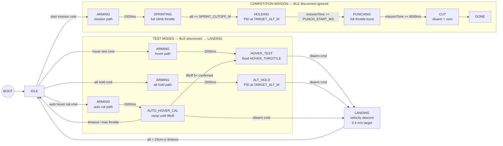
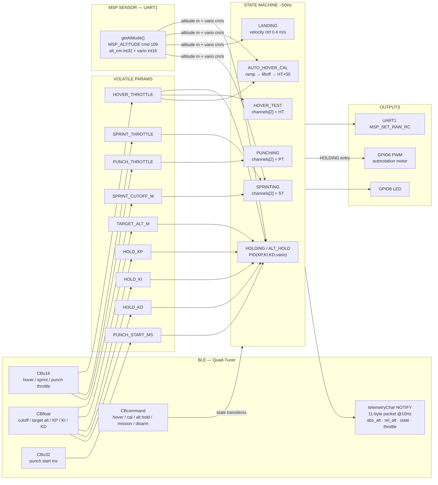

# Quad Mission Controller

Autonomous competition launch system for a 3" FPV quadcopter. The goal is to maximize total air time under a strict **8-second powered flight limit** and **60ft altitude requirement**.

The quad sprints to 60ft as fast as possible, holds altitude while the clock runs down, then punches full throttle in the final moments to build upward velocity before motor cut. Descent is handled by an onboard autorotation device that is pre-spun by a brushed DC motor during the climb. No RC transmitter or receiver is used — an ESP32-C3 acts as the flight controller's RC input via MSP over UART.

---

## Hardware

| Component | Role |
|---|---|
| Happymodel EX1404 4800KV (×4) | Propulsion |
| HQProp T3×2×3 | Props |
| GNB 300mAh 3S 80C LiHV XT30 | Power |
| SpeedyBee F405 Mini BLS 35A Stack | FC + ESC |
| ESP32-C3 Super Mini | Mission controller |
| Brushed DC motor (3–12V) | Autorotation pre-spin |
| 2N2222 NPN transistor + 1N4148 + 100Ω | Brushed motor driver |

---

## Wiring

```
GNB 3S LiHV
  └── XT30 → ESC VBAT/GND pads
        └── 100µF cap across VBAT/GND (as close to pads as possible)

FC stack (pre-wired via harness)
  ├── 5V BEC → ESP32 VIN
  ├── GND    → ESP32 GND
  ├── UART2 TX → ESP32 GPIO5
  ├── UART2 RX → ESP32 GPIO4
  └── 9V BEC → Brushed motor (+)

NPN transistor circuit (brushed autorotation motor):
  ESP32 GPIO6 → 100Ω → 2N2222 base
  2N2222 emitter → GND
  2N2222 collector → Brushed motor (-)
  1N4148 flyback: anode→collector, cathode→9V pad
  100µF cap across 9V pad and GND
```

**ESP32-C3 Pin Assignment**

| GPIO | Function |
|---|---|
| 4 | UART1 TX → FC RX2 |
| 5 | UART1 RX ← FC TX2 |
| 6 | PWM → 2N2222 base (via 100Ω) |
| 8 | Status LED (built-in) |
| 9 | Do not use (boot pin) |
| 20/21 | USB debug (keep free) |

---

## Betaflight Configuration

Flash target: `SPEEDYBEEF405MINI`

**Ports tab**
- UART2: MSP only — no Serial RX on this port

**Configuration tab**
- Receiver mode: MSP (`feature RX_MSP`)
- ESC protocol: DSHOT300
- `set yaw_motors_reversed = ON` (if motors spin wrong direction)
- `set min_check = 1005`

**Modes tab**
- AUX1 HIGH (>1700) → Arm
- AUX2 HIGH (>1700) → Angle Mode

**Failsafe**
- Procedure: DROP
- Delay: 1.0s

**CLI**
```
serial 1 1 115200 57600 0 115200
set vbat_max_cell_voltage = 435
set battery_cell_count = 3
save
```

> If you can't connect Betaflight Configurator, open a serial terminal on the ESP32's COM port at 115200, type `#` to enter the FC CLI directly.

**Accelerometer calibration** — do this before every tuning session on a flat surface with props off. Consistent horizontal drift during hover is almost always a bad accel calibration. Use `board_align_roll` / `board_align_pitch` (tenths of a degree) to null any residual tilt after calibration.

---

## State Machine



---

## Mission Profile (Competition)

```
ARMING    1500ms settle — throttle held at 1000, AUX1 high
SPRINT    Full SPRINT_THROTTLE until SPRINT_CUTOFF_M (~56ft)
          Autorotation motor begins pre-spin on HOLDING entry
HOLD      PID controller (Kp/Ki/Kd) stations at TARGET_ALT_M (60ft)
PUNCH     Full PUNCH_THROTTLE from PUNCH_START_MS until 8000ms
CUT       FC disarms, motors stop, autorotation descent begins
```

---

## LED Patterns

| Pattern | State |
|---|---|
| Slow single blink (1s) | IDLE |
| Fast double blink (200ms) | ARMING |
| Rapid strobe (100ms) | SPRINTING |
| Solid on | HOLDING |
| Very fast strobe (50ms) | PUNCHING |
| Medium blink (300ms) | AUTO HOVER CAL |
| Medium blink (500ms) | HOVER TEST / ALT HOLD |
| Slow strobe (200ms, short on) | LANDING |
| Rapid double blink | DONE |

---

## BLE Tuner

Open `quad_tuner.html` directly in Chrome (Android or desktop). Connect to device named `Quad-Tuner`. Web BLE requires Chrome — not Firefox, Edge, or iOS Safari.

```pwsh
start chrome C:\Users\ryanh\esp32_drone\quad_tuner.html
```

**Commands**

| Button | Behavior |
|---|---|
| Hover Test | Arms → fixed `HOVER_THROTTLE`. Adjust slider live to find neutral buoyancy. |
| Auto Hover Cal | Arms → ramps throttle until 5 consecutive readings above 15cm → writes `HOVER_THROTTLE` (with +50µs ground-effect offset) → stays in Hover Test. |
| Alt Hold | Arms → PID holds `TARGET_ALT_M`. BLE disconnect triggers auto-land. |
| Start Mission | Arms → full sprint/hold/punch/cut sequence. BLE disconnect ignored during mission. |
| Disarm | In test modes: smooth velocity-based landing. In mission: immediate disarm. |
| Sync Values | Re-reads all parameters from ESP32. |
| Bench Mode | Simulates altitude for desk testing. Never fly with this on. |

**Preflight panel** (always visible after connect) shows live absolute altitude, relative altitude, state, and throttle at ~10Hz via BLE notify.

**Active state strip** appears whenever not idle — shows state name, altitude, throttle, and a DISARM button. During Auto Hover Cal an inline progress panel shows altitude bar (0–50cm with 15cm threshold marker) and throttle bar. On cal completion a notification shows the detected hover throttle and auto-syncs the slider.

---

## Tunable Parameters

All parameters are writable live over BLE. Changes take effect immediately and persist until reboot.

| Parameter | Default | Encoding | Description |
|---|---|---|---|
| `HOVER_THROTTLE` | 1420 µs | uint16 | Neutral hover throttle. Use Auto Hover Cal for first-pass, then fine-tune in Hover Test. |
| `SPRINT_THROTTLE` | 1850 µs | uint16 | Full climb throttle during sprint. Higher = faster to 60ft = more punch time. |
| `SPRINT_CUTOFF_M` | 17.0 m | float×100 | Altitude to stop sprinting. Keep below 18.3m to absorb baro lag. |
| `TARGET_ALT_M` | 18.3 m | float×10 | Hold target for both Hold phase and Alt Hold test mode. 60ft = 18.3m. |
| `HOLD_KP` | 120.0 | float×10 | P-gain: throttle correction per metre of altitude error. |
| `HOLD_KI` | 15.0 | float×10 | I-gain: integrates steady-state offset over time. Keep low to avoid windup. |
| `HOLD_KD` | 80.0 | float×10 | D-gain: damps via FC vertical velocity (vario). Reduces oscillations. |
| `PUNCH_START_MS` | 7500 ms | uint32 | Mission clock time to begin final burst. Later = more exit velocity. |
| `PUNCH_THROTTLE` | 2000 µs | uint16 | Max throttle for punch phase. |

---

## Altitude Hold PID

The hold controller runs in both `HOLDING` (mission) and `ALT_HOLD` (test) states:

```
error     = TARGET_ALT_M - altitude
integral += error × dt          (clamped ±10 m·s to prevent windup)
vario_ms  = FC_vario_cm_s / 100

throttle = HOVER_THROTTLE
         + KP × error
         + KI × integral
         - KD × vario_ms        (negative: climbing → reduce throttle)
```

The D term uses vertical velocity directly from the FC's MSP_ALTITUDE response (vario field), avoiding noisy numerical differentiation of the altitude signal.

**Landing** uses a velocity controller targeting `DESCENT_RATE_MPS = 0.4 m/s` downward, also driven by FC vario. Motors cut when altitude drops below 15cm or after a 30s timeout.

---

## Tuning Sequence

1. **Accelerometer calibration** — drone flat and still, Betaflight Setup → Calibrate Accelerometer
2. **Auto Hover Cal** — gets a first-pass `HOVER_THROTTLE` automatically
3. **Hover Test** — fine-tune `HOVER_THROTTLE` until neutrally buoyant. Note: cal detects near-ground liftoff (+50µs ground-effect offset applied automatically)
4. **Alt Hold test** — command a low target (e.g. 1.5m), verify PID holds it. Tune `HOLD_KP/KI/KD`:
   - Oscillating → raise `HOLD_KD`, lower `HOLD_KP`
   - Steady sag/climb → raise `HOLD_KI`
   - Sluggish response → lower `HOLD_KD`, raise `HOLD_KP`
5. **Sprint test** — low altitude, confirm climb rate and cutoff
6. **Full mission dry run** — confirm sprint→hold→punch→cut timing
7. **Punch timing** — adjust `PUNCH_START_MS`: later = more exit velocity

---

## Auto Hover Calibration Detail

- Starts at `CAL_START_THROTTLE = 1150 µs`, steps up 5µs every 250ms
- Liftoff confirmed after **5 consecutive readings** above 15cm (debounce against baro noise)
- Final `HOVER_THROTTLE = calThrottle + 50 µs` (ground-effect offset — free-air hover needs more throttle than near-ground liftoff)
- `launchAlt` is set at the ARMING→CAL transition (after 1500ms motor settle), not before, to avoid baro drift pre-triggering the threshold
- Cal times out after 30s or at `CAL_MAX_THROTTLE = 1650 µs`

---

## BLE Safety

- **Test states** (`HOVER_TEST`, `ALT_HOLD`, `AUTO_HOVER_CAL`): BLE disconnect triggers velocity-based landing immediately
- **Mission states** (`SPRINTING`, `HOLDING`, `PUNCHING`): BLE disconnect is ignored — the mission runs to completion autonomously
- On reconnect, the ESP32 restarts advertising automatically; reconnect from the browser to resume monitoring

---

## Variable & Data Flow



---

## Bench Mode

Toggle from `quad_tuner.html` while idle. Simulates altitude so mission flow and auto hover cal can be tested on the desk without a flight controller connected. Defaults off on every boot — never fly with it on.

---

## Build & Flash

**Install board support**
```pwsh
arduino-cli config init
arduino-cli config add board_manager.additional_urls https://raw.githubusercontent.com/espressif/arduino-esp32/gh-pages/package_esp32_index.json
arduino-cli core update-index
arduino-cli core install esp32:esp32
```

**Install dependencies**
```pwsh
arduino-cli lib install "NimBLE-Arduino"
```

**Compile**
```pwsh
arduino-cli compile --fqbn esp32:esp32:esp32c3:CDCOnBoot=cdc .
```

> `CDCOnBoot=cdc` is required — without it `Serial` does not map to the USB port.

**Upload**
```pwsh
arduino-cli board list
arduino-cli upload --fqbn esp32:esp32:esp32c3:CDCOnBoot=cdc --port COM11 .
```

**Monitor**
```pwsh
arduino-cli monitor --port COM11 --config baudrate=115200
```

> The ESP32-C3 Super Mini uses USB CDC — no separate UART chip. The port may re-enumerate on a new COM number after flashing; re-run `board list` if it disappears.

---

## Files

```
esp32_drone/
  esp32_drone.ino    — ESP32-C3 firmware
  quad_tuner.html    — BLE tuner UI shell
  quad_tuner.css     — styles
  quad_tuner.js      — BLE logic, slider handlers, telemetry
  Wiring Diagram.drawio
  README.md          — this file
```
