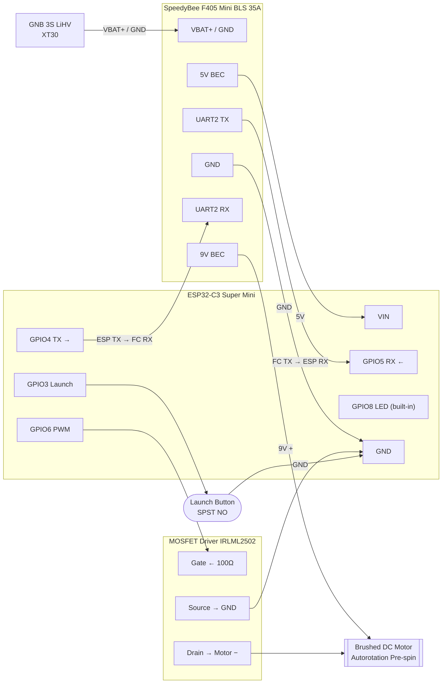

# Quad Mission Controller

Autonomous competition launch system for a 3" FPV quadcopter. The goal is to maximize total air time under a strict **8-second powered flight limit** and **60ft altitude requirement**.

The quad sprints to 60ft as fast as possible, holds altitude while the clock runs down, then punches full throttle in the final moments to build upward velocity before motor cut. Descent is handled by an onboard autorotation device that is pre-spun by a brushed DC motor during the climb. No RC transmitter or receiver is used — an ESP32-C3 acts as the flight controller's RC input via MSP over UART.

---

## Hardware

| Component | Role |
|---|---|
| Happymodel EX1404 4800KV (×4) | Propulsion |
| HQProp T3×2×3 | Props |
| GNB 300mAh 3S 80C LiHV XT30 | Power |
| SpeedyBee F405 Mini BLS 35A Stack | FC + ESC |
| ESP32-C3 Super Mini | Mission controller |
| Brushed DC motor (3–12V) | Autorotation pre-spin |
| IRLML2502 MOSFET + 1N4148 + 100Ω | Brushed motor driver |
| Momentary push button (SPST NO) | Launch trigger |

---

## Wiring Diagram



## Wiring

```
GNB 3S LiHV
  └── XT30 → ESC VBAT/GND pads
        └── 100µF cap across VBAT/GND (as close to pads as possible)

FC stack (pre-wired via harness)
  ├── 5V BEC → ESP32 VIN
  ├── GND    → ESP32 GND
  ├── TX2    → ESP32 GPIO5
  ├── RX2    → ESP32 GPIO4
  └── 9V BEC → Brushed motor (+) via MOSFET drain

MOSFET circuit (brushed autorotation motor):
  ESP32 GPIO6 → 100Ω → MOSFET gate (IRLML2502)
  MOSFET source → GND
  MOSFET drain  → Brushed motor (-)
  1N4148 flyback: anode→drain, cathode→9V pad
  100µF cap across 9V pad and GND

Launch trigger:
  GPIO3 → one leg of button → GND
```

**ESP32-C3 Pin Assignment**

| GPIO | Function |
|---|---|
| 3 | Launch trigger (INPUT_PULLUP, active LOW) |
| 4 | UART1 TX → FC RX2 |
| 5 | UART1 RX ← FC TX2 |
| 6 | PWM → MOSFET gate |
| 8 | Status LED (built-in) |
| 20/21 | USB debug (keep free) |
| 9 | Do not use (boot pin) |

---

## Mission Profile

```
ARMING     → FC arms over MSP, 1.5s settle
SPRINTING  → Full throttle (SPRINT_THROTTLE) until SPRINT_CUTOFF altitude
HOLDING    → P-controller holds 60ft, autorotation motor starts spinning
PUNCHING   → Max throttle from PUNCH_START_MS until 8000ms
CUT        → FC disarmed, motors off, autorotation descent begins
```

Short press launch button → **hover test mode** (tune HOVER_THROTTLE)
Long press (1s+) → **full mission**

**LED states**

| Pattern | State |
|---|---|
| Slow single blink | IDLE |
| Fast flicker | ARMING |
| Rapid double blink | SPRINTING |
| Solid | HOLDING |
| Very fast strobe | PUNCHING |
| Medium blink | HOVER TEST |
| Rapid strobe | DONE |

---

## Betaflight Configuration

Flash target: `SPEEDYBEEF405MINI`

**Ports tab**
- UART2: MSP enabled

**Configuration tab**
- Receiver mode: Serial RX
- Serial receiver provider: MSP
- Feature: RX_SERIAL
- ESC protocol: DSHOT300

**Modes tab**
- AUX1 HIGH → Arm
- AUX2 HIGH → Angle Mode

**Failsafe tab**
- Procedure: DROP
- Delay: 1.0s

**CLI**
```
set vbat_max_cell_voltage = 435
set battery_cell_count = 3
save
```

---

## Tunable Parameters

All parameters are writable live over BLE using `quad_tuner.html` in Chrome (Android or desktop). Connect to device named `Quad-Tuner`.

> Open the file directly in Chrome: `start chrome C:\Users\ryanh\esp32_drone\quad_tuner.html`
> Web BLE requires Chrome — not Firefox, Edge, or iOS Safari.
> If the device doesn't appear in the scan dialog, check `chrome://bluetooth-internals/#devices` to confirm Chrome can see it.

| Parameter | Default | Description |
|---|---|---|
| `HOVER_THROTTLE` | 1420 | Throttle at neutral hover. Find in hover test mode first. |
| `SPRINT_THROTTLE` | 1850 | Full climb throttle during sprint phase. |
| `SPRINT_CUTOFF_M` | 18.0 | Altitude (m) to stop sprinting and begin hold. |
| `TARGET_ALT_M` | 18.3 | Hold target altitude (60ft = 18.3m). |
| `HOLD_KP` | 120.0 | P-gain for altitude hold. Throttle correction per metre of error. |
| `PUNCH_START_MS` | 7500 | Mission clock time (ms) to begin final throttle burst. |
| `PUNCH_THROTTLE` | 2000 | Max throttle for punch phase. |

---

## Tuning Sequence

1. **Find hover throttle** — hover test mode, adjust `HOVER_THROTTLE` via BLE until neutrally buoyant
2. **Verify MSP** — Betaflight receiver tab should show live channel values with ESP32 powered
3. **Verify motor directions** — Betaflight motors tab, props-out configuration
4. **Low-altitude sprint test** — confirm climb rate, adjust `SPRINT_THROTTLE`
5. **Tune hold** — confirm quad stations at 60ft, adjust `HOLD_KP` if oscillating or drifting
6. **Tune punch timing** — adjust `PUNCH_START_MS`, later = more exit velocity = more air time
7. **Verify pre-spin** — autorotation device must be fully spun before motor cut at 8s

---

## Arduino CLI

### Install board support

```pwsh
arduino-cli config init
arduino-cli config add board_manager.additional_urls https://raw.githubusercontent.com/espressif/arduino-esp32/gh-pages/package_esp32_index.json
arduino-cli core update-index
arduino-cli core install esp32:esp32
```

### Install dependencies

```pwsh
arduino-cli lib install "NimBLE-Arduino"
```

### Compile

```pwsh
arduino-cli compile --fqbn esp32:esp32:esp32c3:CDCOnBoot=cdc .
```

> `CDCOnBoot=cdc` is required — without it `Serial` does not map to the USB port and the serial monitor shows nothing.

### Upload

Find your port first:
```pwsh
arduino-cli board list
```

Then upload:
```pwsh
arduino-cli upload --fqbn esp32:esp32:esp32c3:CDCOnBoot=cdc --port COM11 .
```

### Monitor serial output

```pwsh
arduino-cli monitor --port COM11 --config baudrate=115200
```

> On Windows, use the `COM` port reported by `arduino-cli board list`.
> On macOS, use something like `/dev/cu.usbmodem101`.
> The ESP32-C3 Super Mini uses USB CDC — no separate USB-UART chip. If the port disappears after flashing, re-run `arduino-cli board list` as it may re-enumerate on a new COM number.

---

## Files

```
esp32_drone/
  esp32_drone.ino    — ESP32-C3 mission controller firmware
  quad_tuner.html    — BLE live tuning page (open in Chrome)
  architecture.md    — state machine and variable flow diagrams
  README.md          — this file
```