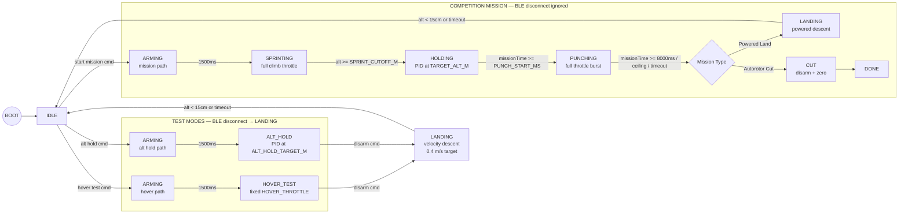
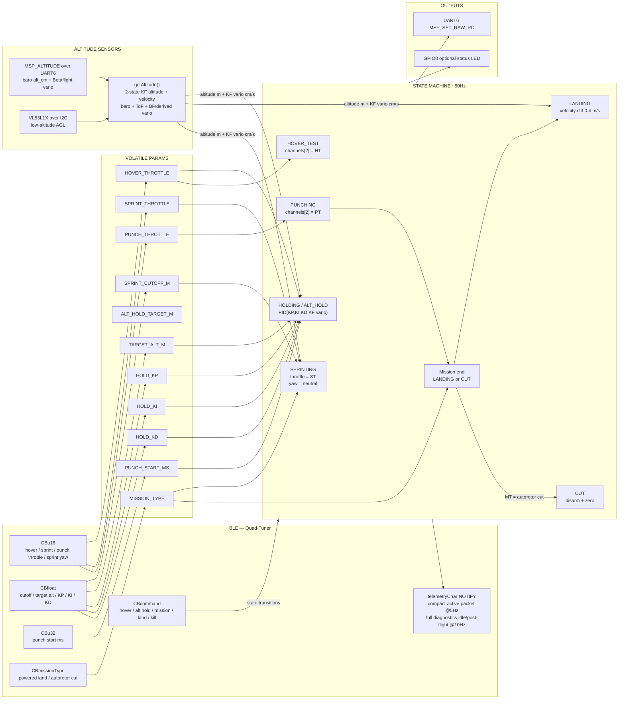

# Quad Mission Controller

Autonomous competition launch system for a 4" FPV quadcopter. The goal is to maximize total air time under a strict **8-second powered flight limit** and **60ft altitude requirement**.

The quad sprints toward 60ft while commanding clockwise yaw to spin the mechanical autorotor through its one-way bearing, hands off to a cascaded altitude controller, then runs the selected final phase: powered landing for validation flights or motor cut for the real unpowered descent. No RC transmitter or receiver is used — an ESP32-S3 acts as the flight controller's RC input via MSP over UART.

---

## Hardware

| Component | Role |
|---|---|
| Happymodel EX1404 4800KV (×4) | Propulsion |
| 4" props | Current propulsion setup |
| GNB 300mAh 2–3S 80C LiHV XT30 | Power |
| BetaFPV F4 2-3S AIO | FC + ESC |
| ESP32-S3 Super Mini | Mission controller |
| VL53L1X ToF sensor | Low-altitude AGL altitude reference |

---

## Wiring

```
GNB 3S LiHV
  └── XT30 → ESC VBAT/GND pads
        └── 100µF cap across VBAT/GND (as close to pads as possible)

BetaFPV F4 2-3S
  ├── 5V pad  → ESP32 VIN
  ├── GND pad → ESP32 GND
  ├── UARTx TX → ESP32 GPIO5  (x = whichever UART pad is used; note for CLI serial command)
  └── UARTx RX → ESP32 GPIO4

VL53L1X ToF sensor
  ├── VIN/VCC → ESP32 3V3  (sensor operating range is 2.6–3.5V; do not power a bare LGA sensor from 5V)
  ├── GND     → ESP32 GND
  ├── SDA     → ESP32 GPIO10
  ├── SCL     → ESP32 GPIO11
  ├── INT     → not connected
  └── SHUT    → not connected by default (`TOF_SHUT_PIN = -1`)

```

**ESP32-S3 Super Mini Pin Assignment**

| GPIO | Function |
|---|---|
| 4 | ESP32 UART1 TX → FC RX pad (currently R6) |
| 5 | ESP32 UART1 RX ← FC TX pad (currently T6) |
| 8 | Optional external status LED output |
| 10 | I2C SDA → VL53L1X SDA |
| 11 | I2C SCL → VL53L1X SCL |
| 48 | Onboard WS2812/RGB LED, not used by the current `digitalWrite()` status code |
| 43/44 | Hardware UART0 TX/RX pins; keep free unless intentionally debugging over UART |
| USB | Native USB serial for flashing and monitor |

---

## Betaflight Configuration

Flash target: `BETAFPVF4` (select in Betaflight Configurator firmware flasher — verify exact target name against the board label)

**Physical mounting**
- FC mounted right-side up (component/chip side facing up), arrow pointing toward the front of the frame
- The BetaFPV F4 target has a hardware gyro alignment of **CW 90° flip** (visible in Setup → Active IMU) — this is normal and expected; Betaflight compensates for it automatically. Do not add software corrections to work around it.
- Verify orientation: Betaflight Setup tab → 3D model should tip forward when you tilt the nose down, and tip left when you tilt left. If it moves wrong, adjust `align_board_yaw` only.
- Software board alignment should be **0, 0, 0** for right-side-up mounting with arrow pointing forward

**Ports tab**
- Assign the UART connected to ESP32 GPIO4/5: MSP only — no Serial RX on this port
- Current wiring uses physical `T6/R6`, which is UART6 in Betaflight and CLI `serial 5`

**Configuration tab**
- Receiver mode: MSP (`feature RX_MSP`)
- Channel map: `AETR1234`. The firmware sends throttle at index 2 and yaw at index 3, so a different map changes the meaning of the mission commands.
- ESC protocol: DSHOT300 (BetaFPV F4 target default — do not change)
- `set min_check = 1005`

**Motors tab**
- Verify motor spin directions match Quad X layout (viewed from above):
  ```
       FRONT
   M4(CW)   M2(CCW)
   M3(CCW)  M1(CW)
       BACK
  ```
- Use the per-motor **Reversed** direction checkboxes in the Motors tab to correct any motors spinning the wrong way — this sends a persistent DShot direction command to the ESC
- Motor test (props off, battery on): spin each motor one at a time and confirm it drives the correct physical corner in the correct direction before first flight
- Props must match motor direction: CW motor → CW prop, CCW motor → CCW prop (CCW props are typically marked with an "R" suffix)
- Before a powered autorotor test, remove the props and use Hover Test yaw to confirm the commanded yaw channel and direction. Then verify the assembled aircraft/rotor turns clockwise viewed from above at restrained power; the motor diagram confirms mixer layout, but cannot confirm the one-way bearing installation.

**Modes tab**
- AUX1 HIGH (>1700) → Arm
- AUX2 HIGH (>1700) → Angle Mode

**Failsafe**
- Procedure: DROP
- Delay: 1.0s

**CLI**
```
# T6/R6 pads are UART6. Betaflight CLI serial port IDs are zero-based:
# UART1 = 0, UART2 = 1, ..., UART6 = 5.
serial 5 1 115200 57600 0 115200

# Board alignment — right-side up, arrow pointing forward
set align_board_roll = 0
set align_board_pitch = 0
set align_board_yaw = 0   # confirmed: FC arrow points toward front of frame

# Receiver / MSP control
feature RX_MSP

# Modes
# ARM on AUX1 high, ANGLE on AUX2 high, HORIZON disabled.
# AUX3 is beeper, AUX4 is flip-over-after-crash; ESP32 keeps both low.
aux 0 0 0 1700 2100 0 0
aux 1 1 1 1700 2100 0 0
aux 2 2 1 900 900 0 0
aux 3 13 2 1700 2100 0 0
aux 4 35 3 1650 2100 0 0

# Throttle / motor idle
set min_check = 1005
set dshot_idle_value = 800   # default 550 — raised to 800 to prevent low-RPM desync/dropout

# Disable throttle/PID helpers that can fight the ESP32 altitude controller
set throttle_boost = 0
set anti_gravity_gain = 0
set iterm_relax = RP
set airmode_start_throttle_percent = 0
set crash_recovery = OFF

# RPM filter — requires bidirectional DSHOT
# Confirmed working on BetaFPV F4: RPM readouts visible in Motors tab
set dshot_bidir = ON
set rpm_filter_harmonics = 1

# Runaway takeoff prevention — disable during initial tuning
# Re-enable (set to ON) once motor directions and hover throttle are confirmed correct
set runaway_takeoff_prevention = OFF

# AIRMODE must be disabled — with AIRMODE on, PID corrections remain active at zero throttle
# and create a vibration feedback loop at low throttle that drives all motors well above idle,
# causing rapid ESC overheating. AIRMODE is for freestyle/acrobatics only.
feature -AIRMODE

save
```

> If you can't connect Betaflight Configurator, open a serial terminal on the ESP32's COM port at 115200, type `#` to enter the FC CLI directly.

**Accelerometer calibration** — do this on a flat surface with props off before the first hover session and after any remounting of the FC. Consistent horizontal drift during hover is almost always a bad accel calibration.

---

## State Machine



---

## Mission Profile (Competition)

```
ARMING    1500ms settle — throttle held at 1000, AUX1 high
SPRINT    Full SPRINT_THROTTLE until SPRINT_CUTOFF_M (~49ft)
          Yaw remains neutral throughout takeoff and climb
          to start the one-way-bearing rotor in the descent direction
HOLD      PID controller (Kp/Ki/Kd) stations at TARGET_ALT_M (60ft)
PUNCH     PUNCH_THROTTLE from PUNCH_START_MS until 8000ms
END       Powered LANDING or CUT, based on selected mission type
```

---

## LED Patterns

| Pattern | State |
|---|---|
| Slow single blink (1s) | IDLE |
| Fast double blink (200ms) | ARMING |
| Rapid strobe (100ms) | SPRINTING |
| Solid on | HOLDING |
| Very fast strobe (50ms) | PUNCHING |
| Medium blink (500ms) | HOVER TEST / ALT HOLD |
| Slow strobe (200ms, short on) | LANDING |
| Rapid double blink | DONE |

---

## BLE Tuner

Open `quad_tuner.html` directly in Chrome (Android or desktop). Connect to device named `Quad-Tuner`. Web BLE requires Chrome — not Firefox, Edge, or iOS Safari.

```pwsh
start chrome C:\Users\ryanh\esp32_drone\quad_tuner.html
```

**Commands**

| Button | Behavior |
|---|---|
| Hover Test | Arms → fixed `HOVER_THROTTLE`. Adjust slider live to find neutral buoyancy. Uses `HOVER_TEST_ANGLE_MODE`, defaulting to Acro/rate mode. |
| Alt Hold | Arms → PID holds `ALT_HOLD_TARGET_M`. BLE disconnect triggers auto-land. |
| Mission Type | Idle-only toggle between `Autorotor Cut` and `Powered Land`. Autorotor Cut is the boot default: it adds clockwise sprint yaw and cuts the flight motors at mission end/ceiling/timeout. |
| Start Mission | Arms -> max-throttle sprint -> cascaded hold/punch -> selected mission ending. BLE disconnect ignored during mission. |
| Land | In test modes: smooth velocity-based landing. Hidden/disabled during mission. |
| Kill Motors | Immediate motor cut from any state. Use this as the emergency stop. |
| Sync Values | Re-reads all parameters from ESP32. |
| Bench Mode | Simulates altitude for desk testing. Never fly with this on. |
| Angle Mode | Drives AUX2 high/low for Betaflight Angle mode. Can be changed only while idle or done. |

**Preflight panel** (always visible after connect) shows full altitude, vario, ToF, baro, and FC diagnostic values while idle/post-flight. During active flight it switches to a compact health packet at 5Hz: altitude, state, throttle, vario, active sources, and MSP/ToF/attitude/RC health. MSP parsing, control, and RC output run before best-effort BLE telemetry; late cycles skip the notification. This keeps BLE work from delaying flight control.

**Active state strip** appears whenever not idle — shows state name, altitude, throttle, and a KILL button.

---

## Tunable Parameters

All parameters are writable live over BLE. Changes take effect immediately and persist until reboot.

| Parameter | Default | Encoding | Description |
|---|---|---|---|
| `HOVER_THROTTLE` | 1400 µs | uint16 | Current measured hover baseline for 4-inch props with the full autorotation assembly. Fine-tune in Hover Test whenever the flight mass changes. |
| `SPRINT_THROTTLE` | 2000 us | uint16 | Max-throttle open-loop climb before cascade handoff. |
| `PUNCH_YAW` | 1900 us | uint16 | Flight-proven clockwise mission yaw, applied for longer from `MISSION_YAW_SPIN_START_MS` through the final kick in both mission types. |
| `MISSION_YAW_SPIN_START_MS` | 6000 ms | compile-time | Starts autorotor yaw spin-up during closed-loop hold without starting the throttle punch. Yaw continues through the 8-second cutoff. |
| `HOVER_TEST_YAW` | 1500 us | uint16 | Manual Hover Test yaw command. Defaults neutral; move deliberately toward 1900 to verify the kick direction and authority. |
| `SPRINT_CUTOFF_M` | 15.8 m | float x100 | Altitude where sprint hands off to cascaded hold, tuned from the 17.54m peak in the previous 15.0m-cutoff run. |
| `TARGET_ALT_M` | 18.3 m | float×10 | Mission hold target. 60ft = 18.3m. Used by `HOLDING` after sprint cutoff. |
| `ALT_HOLD_TARGET_M` | 1.5 m | float×10 | Test target used only by the BLE `ALT_HOLD` command; firmware clamps active command to 0.5–10.0m. |
| `HOLD_KP` | 0.8 | float×10 | Outer altitude P: altitude error (m) to desired vertical speed (m/s). |
| `HOLD_KI` | 0.0 | float×10 | Inner speed I: integrated vertical-speed error to throttle offset (µs). Start disabled; add only after logs show steady bias. |
| `HOLD_KD` | 110.0 | float×10 | Inner speed P: vertical-speed error (m/s) to throttle offset (µs). Raised after logs showed under-braking during takeoff overshoot. |
| `ALT_RAMP_RATE_MPS` | 0.40 m/s | float×100 | Alt Hold internal setpoint ramp. Raise outdoors when the vehicle has enough altitude room. |
| `MAX_CLIMB_MPS_TEST` | 0.25 m/s | float×100 | Alt Hold test-mode climb-speed cap. This was the main limit in the first 10m outdoor attempt. |
| `MAX_DESCENT_MPS_TEST` | 0.35 m/s | float×100 | Alt Hold test-mode descent-speed cap. Gives the controller enough authority to brake low-altitude overshoot. |
| `BF_VARIO_GROUND_EFFECT_M` | 1.20 m | float×100 | Height below which the KF inflates Betaflight vario covariance to reduce ground-effect influence. Lower outdoors to trust BF vario earlier. |
| `PUNCH_START_MS` | 7000 ms | uint32 | Mission clock time to begin the full-throttle/full-yaw final second before cutoff. |
| `PUNCH_THROTTLE` | 2000 µs | uint16 | Full-throttle final kick from `PUNCH_START_MS` until the 8-second cutoff. |

---

## Altitude Hold PID

The hold controller runs in both `HOLDING` (mission) and `ALT_HOLD` (test) states. Mission `HOLDING` uses `TARGET_ALT_M`; BLE `ALT_HOLD` test mode uses the separate `ALT_HOLD_TARGET_M`.

```
raw_tof         = VL53L1X range, tilt-corrected with MSP_ATTITUDE roll/pitch when fresh
cbaro           = baro shifted toward accepted ToF AGL reference
kf_state        = [altitude, vertical_speed], constant-velocity predict
kf_updates      = cbaro position + gated ToF position + BF vario velocity + derived velocity
fused_altitude  = kf_state.altitude in the mission reference frame
used_vario      = kf_state.vertical_speed
display_vario   = light low-pass of used_vario for UI/log readability only
predicted_alt   = fused_altitude + clamp(used_vario, -lookahead_max_v, +lookahead_max_v) * lookahead_s
alt_error       = internal_setpoint - predicted_alt
desired_vspeed  = clamp(HOLD_KP * alt_error, -max_descent, max_climb)
if ALT_HOLD and fused_altitude < target - capture_margin and used_vario < capture_min_climb:
    desired_vspeed = max(desired_vspeed, capture_min_climb)
vspeed_error    = desired_vspeed - used_vario
candidate_i     = output-limited(vspeed_integral + vspeed_error * dt)

throttle = HOVER_THROTTLE
         + HOLD_KD * vspeed_error
         + HOLD_KI * vspeed_integral
if capture_assist_active and used_vario < capture_floor_max_v:
    throttle = max(throttle, hover_throttle + capture_min_offset_or_recovery)
```

The VL53L1X ToF sensor is the primary low-altitude position measurement. It now runs at `TOF_TIMING_BUDGET_US = 20000us` and `TOF_PERIOD_MS = 25ms` to reduce low-altitude response delay. It is accepted fully below `TOF_BLEND_FULL_M = 1.6m`, fades out by `TOF_BLEND_ZERO_M = 2.2m`, and is ignored when invalid/out of range above `TOF_VALID_MAX_M = 2.5m`. Fresh ToF samples are accepted only when the VL53L1X reports `range_status = 0`; signal-fail/wrap-fail readings are logged and rejected instead of being treated as valid range. Readings below `TOF_VALID_MIN_M` are treated as valid ground contact at `0.0m`, because the sensor is mounted close enough to the ground that it can start below its useful range. Out-of-range high readings are never treated as "4m"; the KF falls back to corrected baro. When `dataReady()` is false but the last accepted ToF sample is recent (`TOF_RECENT_VALID_MS = 130ms`), the firmware holds that value for guard/landing decisions at `TOF_HELD_WEIGHT_PCT = 80`; held values are not fed back into the KF or baro-offset learner as duplicate measurements. Alt Hold and Landing use the single fused-relative altitude frame for control; the older separate ToF-relative baseline is not used for control, avoiding reference-frame steps when sources switch. Motor-cut ground detection still requires valid high-confidence ToF or fallback descent confirmation. Altitude fusion and the ToF jump filter are reset at each mission/cal/Alt Hold start so a previous run cannot leave a stale baro-to-ToF offset or KF state. Single-sample ToF jumps are rejected in the sensor reader above `max(TOF_MAX_STEP_MIN_M, TOF_MAX_STEP_MPS * dt)`, and again before offset/KF measurement update above `TOF_FUSION_MAX_STEP_MPS`.

Betaflight 4.4.3 with `VARIO` enabled exposes a filtered vertical-speed estimate in the `MSP_ALTITUDE` vario field. The firmware now feeds both BF vario and the ESP32-derived vario into the standard 2-state KF as independent velocity measurements. The KF is tuned to respond faster (`KF_Q_ACCEL_PSD = 1.5`, `KF_R_BF_VARIO = 0.3`) while still rejecting bad ToF. Below runtime `BF_VARIO_GROUND_EFFECT_M`, BF vario's covariance is inflated instead of hard-disabled, reducing ground-effect influence while still allowing useful information through. The `usedV` log/UI value is the KF velocity estimate and is used directly by Alt Hold and Landing; `fV` is a display-only low-pass. `bfV` and `derV` remain diagnostic inputs.

MSP telemetry is parsed continuously. `getAltitude()` no longer flushes the UART, sends `MSP_ALTITUDE`, and blocks waiting for a reply; it pumps a byte-stream parser, schedules requests, and returns the latest cached fused altitude. Altitude requests are sent every `MSP_ALTITUDE_PERIOD_MS = 25ms`; FC diagnostics are rotated every `MSP_DIAG_PERIOD_MS = 50ms`. If no altitude frame has arrived for `MSP_ALTITUDE_STALE_MS = 250ms`, control continues with the last fused altitude until freshness checks transition active Alt Hold into Landing.

The displayed vario filter is time-based (`VARIO_TAU_S = 0.05s`) so UI/log smoothing remains stable with loop-rate jitter. It is not in the normal control path. If raw KF vario becomes stale or implausible while altitude hold is active, the controller clears the integrator and transitions to `LANDING` instead of holding the last velocity estimate.

Current default speed limits:

| Mode | Max climb | Max descent |
|---|---:|---:|
| `ALT_HOLD` test | 0.25 m/s | 0.35 m/s |
| Mission `HOLDING` | 1.20 m/s | 0.80 m/s |

The Alt Hold test setpoint ramps at runtime `ALT_RAMP_RATE_MPS`, and its climb/descent caps are runtime `MAX_CLIMB_MPS_TEST` / `MAX_DESCENT_MPS_TEST`. Mission `HOLDING` does not use that slow test ramp: after the open-loop sprint it immediately captures `TARGET_ALT_M`, allowing the velocity loop to brake the real ascent and then continue toward 18.3m before Punch. The outer loop uses `ALT_HOLD_LOOKAHEAD_S = 0.30s` with velocity clamped to `ALT_HOLD_LOOKAHEAD_MAX_V_MPS = 1.0m/s`, so it controls against a short predicted altitude instead of waiting for the measured altitude to cross the target. In `ALT_HOLD` test mode, a capture assist keeps desired climb at least `ALT_HOLD_CAPTURE_MIN_CLIMB_MPS = 0.16 m/s` while altitude is more than `ALT_HOLD_CAPTURE_MARGIN_M = 0.25m` below target and used vario is still below the minimum climb rate. The throttle floor is intentionally weak: it only applies while climb rate is below `ALT_HOLD_CAPTURE_FLOOR_MAX_V_MPS = 0.05 m/s`, and then only forces `ALT_HOLD_CAPTURE_MIN_OFFSET_US = 10us` above hover. If it is already descending faster than `ALT_HOLD_RECOVERY_DESCENT_MPS = -0.08 m/s`, or raw Betaflight vario is below `ALT_HOLD_RECOVERY_BF_DESCENT_CMS = -80 cm/s` before the KF velocity catches up, the floor rises to `ALT_HOLD_RECOVERY_MIN_OFFSET_US = 70us` above hover so it can arrest a low-altitude drop before ground contact. Alt Hold uses a short `BARO_SETTLE_MS = 500ms` settle at `HOVER_THROTTLE - 80us`; immediately after settle, cascade takes over. The vertical-speed integrator is limited by output authority (`VSPEED_I_MAX_US = 150us`). Throttle pull-down is intentionally asymmetric: negative speed errors use `HOLD_KD_DOWN_SCALE = 0.55`, Alt Hold lower authority is limited to `THR_DOWN_OFFSET_ALT_HOLD_US = 150us`, and throttle can only decrease by `THROTTLE_SLEW_DOWN_US = 25us` per cascade update while upward recovery can rise by `THROTTLE_SLEW_UP_US = 100us`. Mission `HOLDING` keeps `MIN_MISSION_THROTTLE_US = 1050us` and the wider mission throttle band to preserve attitude authority.

The current hover baseline is the full 4-inch autorotation assembly at `1400us`. Firmware defaults to `DEFAULT_MISSION_TYPE = 1`, so each reboot selects Autorotor Cut and an unpowered descent. Select `Powered Land` explicitly for powered validation flights. Yaw remains neutral throughout arming, takeoff, sprint, and early hold. Both mission types begin the flight-proven `PUNCH_YAW` during top hold at 6.0s and continue it through the final kick. There is no separate autorotor motor or PWM output. Yaw commands are right/clockwise viewed from above with the required `AETR1234` channel map. Landing and cut explicitly restore yaw to `1500us`; Hover Test uses its separate manual yaw value, which also defaults to `1500us`.

Sprint velocity is expected to exceed the low-altitude test envelope. Raw BF/derived vario inputs and the fused control state therefore use a `10m/s` plausibility envelope (`VARIO_MEAS_MAX_CMS` / `VARIO_CONTROL_MAX_CMS`). A bad or stale estimate must persist for `CASCADE_INVALID_GRACE_MS = 300ms` before ending control. Persistent failure starts powered Landing in test/powered modes, but selects `CUT` in Autorotor Cut mode instead of unexpectedly entering powered Landing.

For a powered outdoor validation with the assembly installed, keep `HOVER_THROTTLE = 1400` and explicitly select `Mission: Powered Land`: sprint to 15.8m, capture toward 18.3m, execute the final kick from 7.0s, then land under power. The default `Mission: Autorotor Cut` performs the actual unpowered descent. Move `SPRINT_CUTOFF_M` based on logs: lower it if the handoff overshoots, and raise it only if the controller has clear braking margin.

**Landing** uses a velocity controller with flare, driven by the same raw KF vario used by Alt Hold. Above `LANDING_FLARE_ALT_M = 0.45m`, it targets `DESCENT_RATE_MPS = 0.35 m/s` downward. Below flare height it progressively slows, reaching `LANDING_FINAL_DESCENT_MPS = 0.07 m/s` below `LANDING_FINAL_ALT_M = 0.20m`, while also raising the base throttle closer to hover. Flare selection uses `LANDING_LOOKAHEAD_S = 0.25s`, so fast descent starts softening before the measured altitude reaches the threshold. Landing throttle ramps down over `LANDING_ENTRY_RAMP_MS = 900ms` instead of chopping immediately when Land is commanded during a climb. Below `LANDING_LOW_ALT_FLOOR_M = 0.65m`, descent-rate-dependent throttle floors keep enough thrust to avoid hitting the floor and rebounding before flare catches up. Motors cut when valid ToF sees `LANDING_GROUND_M = 0.06m`, when baro/fused altitude reaches ground after real descent, when landing starts already at ground height, or after a 30s timeout. `ALT_HOLD` and `LANDING` also disarm if fresh FC attitude exceeds `ATTITUDE_ABORT_DEG = 45` degrees roll or pitch, which catches net/contact/tip-over failures instead of continuing to drive the motors.

Each `ALT_HOLD` test or mission stores a per-run CSV-style log:

```
[RUN] MISSION type=... hover=... sprintThr=... cutoff=... target=... yawSpinStart=... punchStart=... punchThr=... punchYaw=...
[FLT] ms,state,phase,alt,lowRel,tof,tofW,baro,cbaro,src,setpt,fV,usedV,bfV,derV,vsrc,desV,aErr,vErr,P,I,rawThr,thr,minThr,maxThr,sat,...,rcThr,cmdYaw,rcArm,...,tofStatus,tofI2c
```

Use `rawThr` versus `thr` plus `sat` to see throttle limiting. `sat=-1` means the controller wanted less throttle than the configured lower clamp; `sat=1` means it wanted more than the upper clamp. `lowRel` is retained as a CSV compatibility column and currently mirrors the fused control altitude. `tofW` confirms whether ToF is contributing to state-machine confidence (`100=fresh`, `80=recent held`, `0=unavailable`) or the KF is falling back toward corrected baro. `src` is `0=baro`, `1=fresh ToF`, `2=blend`, `3=recent held ToF`; `cbaro` is the learned-offset corrected baro altitude. `vsrc` is normally `2=KF`; `bfV` and `derV` are the independent velocity measurements feeding it. `tofRaw` is the direct sensor range in meters, `tofReadOk` is the accepted fresh-read flag, `tofReject` is the firmware wrapper rejection reason (`0` fresh ok, `1` not ready/disabled, `2` `dataReady()` false, `3` timeout, `4` over range, `5` sensor-reader step gate, `6` fusion/KF gate, `7` VL53L1X range-status fail), and `tofDt` is milliseconds since the previous ToF poll attempt. A row may show `tofReject=2` while `tof` is still valid; that means the firmware is using a recent held sample, not a new measurement. `tofStatus` is the Pololu VL53L1X library `ranging_data.range_status` from the last completed read (`0=valid`, `1=sigma fail`, `2=signal fail`, `4=out of bounds`, `7=wrap target fail`, `13=min range fail`, `255=no update`); `tofI2c` is the library's last I2C transmission status.

`cmdYaw` records the ESP32 yaw command. Both mission types keep yaw neutral through climb, then use `PUNCH_YAW` from 6.0s through punch and restore neutral yaw after cutoff. Hover Test applies the separately controlled `HOVER_TEST_YAW`, which defaults neutral. The FC attitude `yaw` column records heading, not the command.

The log also includes FC-side diagnostics when MSP replies are available:

| Field | Source |
|---|---|
| `accX/Y/Z`, `gyroX/Y/Z` | `MSP_RAW_IMU` |
| `roll`, `pitch`, `yaw` | `MSP_ATTITUDE` |
| `cycle`, `sensors` | `MSP_STATUS` |
| `rcThr`, `rcArm`, `rcAngle` | `MSP_RC`, the FC's view of MSP RC input |
| `vbat`, `amps` | `MSP_ANALOG` |
| `diag` | bitmask of received diagnostic groups: bit0 raw IMU, bit1 attitude, bit2 status, bit3 analog, bit4 RC |

The same log is also stored in ESP32 RAM during the run. After landing, reconnect the web UI and click **Download Last Log** in the Params tab to save the latest run as a CSV. Log download is disabled while the aircraft is armed/flying so BLE reads cannot compete with MSP/RC timing. The buffer is `FLIGHT_LOG_BYTES = 60000`, sized for a full 8s mission plus powered landing at the current 50ms sample interval; if it fills, the log ends with `[LOG] truncated`.

Normal flight builds keep `SERIAL_FLIGHT_DEBUG = 0`, so high-rate flight diagnostics are not printed over USB serial. Use the BLE telemetry panel and **Download Last Log** for flight analysis. Set `SERIAL_FLIGHT_DEBUG = 1` only for tethered bench testing.

For desktop analysis, run:

```powershell
.\tools\latest-log.ps1
```

Useful variants:

```powershell
.\tools\latest-log.ps1 -Open       # generate and open preview for newest log
.\tools\latest-log.ps1 -New        # process CSVs with missing/stale previews
python tools\parse_flight_log.py   # summarize newest log directly
```

The preview is separate from the BLE web app. It writes `*.preview.html` beside the CSV and plots altitude sources, setpoint, throttle, vario, source selection, and parsed jump markers.

### Betaflight MSP Setup

No extra Betaflight feature is required to read `MSP_RAW_IMU`, `MSP_ATTITUDE`, `MSP_STATUS`, `MSP_ANALOG`, or `MSP_RC`; they are normal MSP telemetry replies. The UART between the ESP32 and FC must have MSP enabled, and `RX_MSP` must remain enabled if the ESP32 is also sending RC commands.

For the BetaFPV F4 on current physical `T6/R6`, the expected CLI shape is:

```text
feature RX_MSP
serial 5 1 115200 57600 0 115200
save
```

`serial 5` is UART6 on this target. USB VCP usually appears as `serial 20`. In the Ports tab, this corresponds to enabling **MSP** on UART6 at 115200. Keep the receiver configured for MSP if this ESP32 is the RC source. If you move back to `T1/R1`, use `serial 0 1 115200 57600 0 115200` instead.

---

## Tuning Sequence

1. **Accelerometer calibration** — drone flat and still, Betaflight Setup → Calibrate Accelerometer
2. **Hover Test** — fine-tune `HOVER_THROTTLE` until neutrally buoyant with the complete flight assembly installed.
3. **Alt Hold test** — command a low target (e.g. 1.0m), verify PID holds it. Tune `HOLD_KP/KI/KD`:
   - Oscillating or bouncing through the target -> lower `HOLD_KD`, lower speed caps, or lower `HOLD_KP`
   - Steady sag/climb -> raise `HOLD_KI` only after the P/D response is stable
   - Sluggish response -> raise `HOLD_KP` first, then cautiously raise `HOLD_KD`
4. **Sprint test** — low altitude, confirm climb rate and cutoff
5. **Full mission dry run** — confirm sprint→hold→punch→selected ending timing
6. **Punch timing** — adjust `PUNCH_START_MS`: later = more exit velocity

---

`ALT_HOLD` test mode has only a short settle guard. For the first 500ms after entering `ALT_HOLD`, `launchAlt` is refreshed while sensors settle and throttle starts below hover. After that, cascade starts immediately and stays active; it no longer waits for 12cm ToF-confirmed liftoff. This avoids the old pre-liftoff ramp that could build excess upward energy and then bounce when closed-loop finally engaged.

---

## BLE Safety

- **Test states** (`HOVER_TEST`, `ALT_HOLD`) and their arming delay: BLE disconnect triggers velocity-based landing immediately
- **Mission states** (`SPRINTING`, `HOLDING`, `PUNCHING`): BLE disconnect is ignored — the mission runs to completion autonomously
- On reconnect, the ESP32 restarts advertising automatically; reconnect from the browser to resume monitoring

---

## Variable & Data Flow



---

## Bench Mode

Toggle from `quad_tuner.html` while idle. Simulates altitude so mission and Alt Hold state flow can be tested on the desk without a flight controller connected. Defaults off on every boot — never fly with it on.

---

## Angle Mode Toggle

The tuner exposes a BLE `Angle Mode` button that controls AUX2 (`CH_ANGLE`) for Alt Hold, Landing, and Mission states. `Angle Mode: On` sends 1800us; `Angle Mode: Off` sends 1000us. Hover Test uses compile-time `HOVER_TEST_ANGLE_MODE`, defaulting to Acro/rate mode to avoid Angle-mode ground kick during fixed-throttle tests. The firmware rejects UI Angle changes unless the state is `IDLE` or `DONE`.

The boot default is `DEFAULT_ANGLE_MODE = 1`, so autonomous test modes and the mission start with Betaflight Angle mode enabled unless the web UI toggle is changed while idle.

---

## Build & Flash

**Install board support**
```pwsh
arduino-cli config init
arduino-cli config add board_manager.additional_urls https://raw.githubusercontent.com/espressif/arduino-esp32/gh-pages/package_esp32_index.json
arduino-cli core update-index
arduino-cli core install esp32:esp32
```

**Install dependencies**
```pwsh
arduino-cli lib install "NimBLE-Arduino"
arduino-cli lib install "VL53L1X"
```

**Compile**
```pwsh
arduino-cli compile --fqbn esp32:esp32:esp32s3:CDCOnBoot=cdc .
```

> `CDCOnBoot=cdc` is required — without it `Serial` does not map to the USB port.

**Upload**
```pwsh
arduino-cli board list
arduino-cli upload --fqbn esp32:esp32:esp32s3:CDCOnBoot=cdc --port COM11 .
```

**Monitor**
```pwsh
arduino-cli monitor --port COM11 --config baudrate=115200
```

> The ESP32-S3 Super Mini uses native USB CDC. The port may re-enumerate on a new COM number after flashing; re-run `board list` if it disappears.

---

## Files

```
esp32_drone/
  esp32_drone.ino    — Entrypoint: setup() and loop() only
  Config.h           — All compile-time constants (pins, UUIDs, command IDs, cal/landing params)
  State.h / .cpp     — MissionState enum, volatile tunable params, runtime globals, fcSerial
  Tof.h / .cpp       — VL53L1X setup/read helpers and blend weighting
  Msp.h / .cpp       — sendMSP(), sendRC(), getAltitude() with bench-mode sim
  Control.h / .cpp   — holdCascaded(), disarmToIdle(), all start*() state transition functions
  Ble.h / .cpp       — NimBLE callback classes, setupBLE(), telemetry notify
  Mission.h / .cpp   — runMissionLoop(): full state machine switch/case
  quad_tuner.html    — BLE tuner UI shell
  quad_tuner.css     — styles
  quad_tuner.js      — BLE logic, slider handlers, telemetry
  Wiring Diagram.drawio
  README.md          — this file
```
