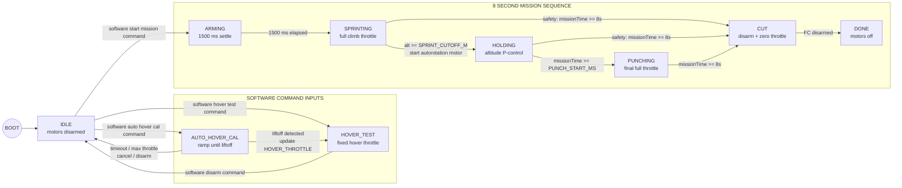
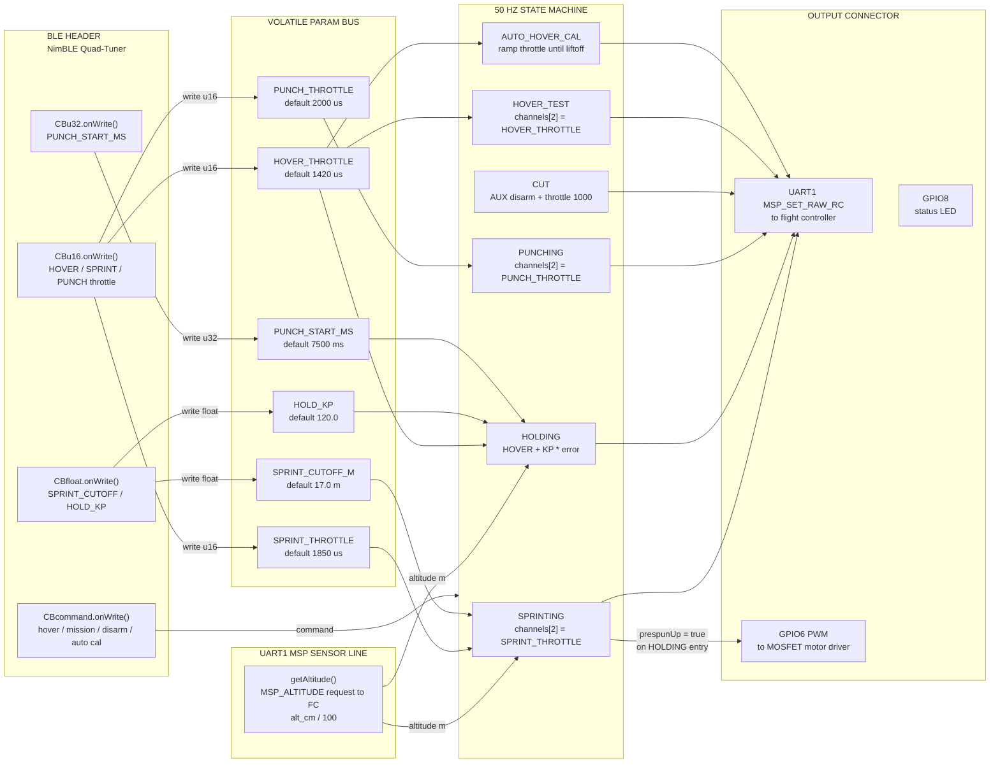

# Code Architecture

## State Machine

```mermaid
flowchart LR
    START(("BOOT"))
    IDLE["IDLE\nmotors disarmed"]

    subgraph SOFTWARE["SOFTWARE COMMAND INPUTS"]
        direction TB
        HOVER_TEST["HOVER_TEST\nfixed hover throttle"]
        AUTO_HOVER_CAL["AUTO_HOVER_CAL\nramp until liftoff"]
    end

    subgraph MISSION["8 SECOND MISSION SEQUENCE"]
        direction LR
        ARMING["ARMING\n1500 ms settle"]
        SPRINTING["SPRINTING\nfull climb throttle"]
        HOLDING["HOLDING\naltitude P-control"]
        PUNCHING["PUNCHING\nfinal full throttle"]
        CUT["CUT\ndisarm + zero throttle"]
        DONE["DONE\nmotors off"]
    end

    START --> IDLE
    IDLE -->|software hover test command| HOVER_TEST
    IDLE -->|software auto hover cal command| AUTO_HOVER_CAL
    IDLE -->|software start mission command| ARMING

    HOVER_TEST -->|software disarm command| IDLE
    AUTO_HOVER_CAL -->|liftoff detected\nupdate HOVER_THROTTLE| HOVER_TEST
    AUTO_HOVER_CAL -->|timeout / max throttle\ncancel / disarm| IDLE

    ARMING -->|1500 ms elapsed| SPRINTING
    SPRINTING -->|alt >= SPRINT_CUTOFF_M\nstart autorotation motor| HOLDING
    SPRINTING -->|safety: missionTime >= 8s| CUT
    HOLDING -->|missionTime >= PUNCH_START_MS| PUNCHING
    HOLDING -->|safety: missionTime >= 8s| CUT
    PUNCHING -->|missionTime >= 8s| CUT
    CUT -->|FC disarmed| DONE

```

---

## Variable & Data Flow

```mermaid
flowchart LR
    subgraph BLE["BLE HEADER\nNimBLE Quad-Tuner"]
        direction TB
        W1["CBu16.onWrite()\nHOVER / SPRINT / PUNCH throttle"]
        W2["CBfloat.onWrite()\nSPRINT_CUTOFF / HOLD_KP"]
        W3["CBu32.onWrite()\nPUNCH_START_MS"]
        W4["CBcommand.onWrite()\nhover / mission / disarm / auto cal"]
    end

    subgraph PARAMS["VOLATILE PARAM BUS"]
        direction TB
        HT["HOVER_THROTTLE\ndefault 1420 us"]
        ST["SPRINT_THROTTLE\ndefault 1850 us"]
        SC["SPRINT_CUTOFF_M\ndefault 17.0 m"]
        KP["HOLD_KP\ndefault 120.0"]
        PS["PUNCH_START_MS\ndefault 7500 ms"]
        PT["PUNCH_THROTTLE\ndefault 2000 us"]
    end

    subgraph SENSOR["UART1 MSP SENSOR LINE"]
        ALT["getAltitude()\nMSP_ALTITUDE request to FC\nalt_cm / 100"]
    end

    subgraph SM["50 HZ STATE MACHINE"]
        direction TB
        SPR["SPRINTING\nchannels[2] = SPRINT_THROTTLE"]
        HLD["HOLDING\nHOVER + KP * error"]
        PUN["PUNCHING\nchannels[2] = PUNCH_THROTTLE"]
        CUT["CUT\nAUX disarm + throttle 1000"]
        HVT["HOVER_TEST\nchannels[2] = HOVER_THROTTLE"]
        AHC["AUTO_HOVER_CAL\nramp throttle until liftoff"]
    end

    subgraph OUT["OUTPUT CONNECTOR"]
        MSP["UART1 MSP_SET_RAW_RC\nto flight controller"]
        PWM["GPIO6 PWM\nto MOSFET motor driver"]
        LED["GPIO8\nstatus LED"]
    end

    W1 -->|write u16| HT
    W1 -->|write u16| ST
    W1 -->|write u16| PT
    W2 -->|write float| SC
    W2 -->|write float| KP
    W3 -->|write u32| PS
    W4 -->|command| SM

    ALT -->|altitude m| HLD
    ALT -->|altitude m| SPR

    HT --> HLD
    KP --> HLD
    ST --> SPR
    SC --> SPR
    PS --> HLD
    PT --> PUN
    HT --> HVT
    HT --> AHC

    SPR --> MSP
    HLD --> MSP
    PUN --> MSP
    CUT --> MSP
    HVT --> MSP
    AHC --> MSP

    SPR -->|prespunUp = true\non HOLDING entry| PWM
    OUT --> LED

```
